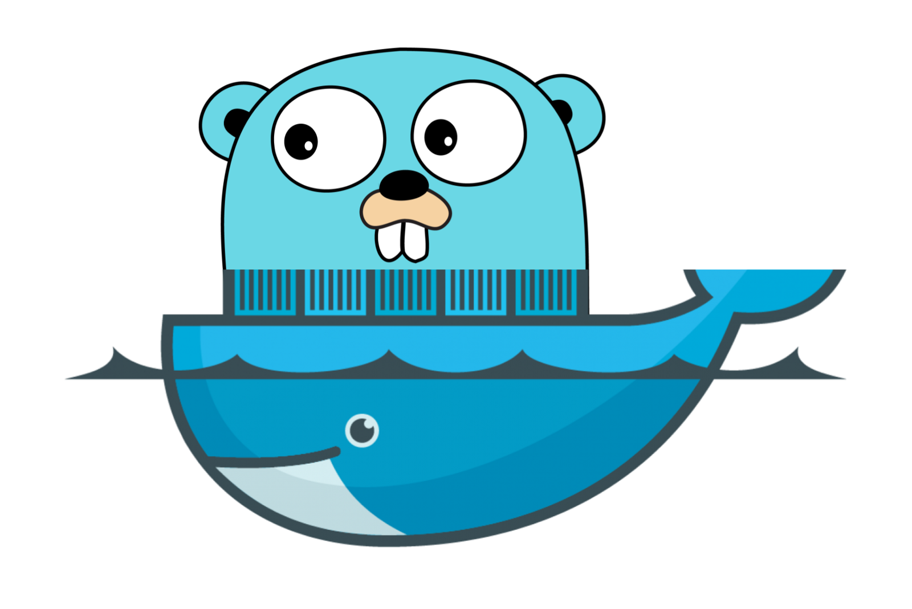

<h1 align="center">
  
</h1>

<h1 align="center">
  Leilão - Quem dá mais?
</h1>

🚀Um site onde você pode divulgar um produto por um lance inicial e que as pessoas irão disputar para o adquirir

 <a href="#objetivo">Objetivo</a> •
 <a href="#roadmap">Roadmap</a> • 
 <a href="#tecnologias">Tecnologias</a> • 
 <a href="#requisitos">Pré-requisitos</a> • 
 <a href="#autor">Autor</a>

<h4 align="center"> 
	🚧  Back Golang 🚀 Em construção...  🚧
</h4>

### Pré-requisitos

Antes de começar, você vai precisar ter instalado em sua máquina as seguintes ferramentas:
[Git](https://git-scm.com), [Docker](https://www.docker.com),[Golang](https://go.dev/dl/). 
Além disto é bom ter um editor para trabalhar com o código como [VSCode](https://code.visualstudio.com)

### 🎲 Rodando a aplicação (Servidor - Frontend + Backend + BD)

# Crie uma pasta local utilizando o terminal
$ mkdir nome_da_pasta

# Clone este repositório
$ git clone <https://github.com/Alisson-Paulino7/leilao-MVC-Golang.git>

# Acesse a pasta do projeto no terminal/cmd
$ cd caminho/do/seu/diretorio

# Abra o Docker instalado na sua máquina

# Execute o comando no CMD para buildar todo o projeto no docker
$  docker-compose up --build ou  docker-compose up --build -d

# O servidor iniciará na porta:8080 - acesse <http://localhost:8080>
# Caso deseje visualizar a interface do PHPmyadmin para visualizar o banco - acesse <http://localhost:9090>
